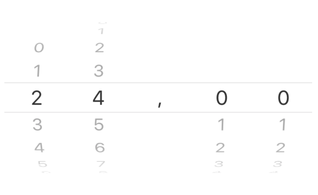

# Multiple List Picker

This plugin allows to create multiple list picker, as Android does. However, instead we use multiple lists, we can use one component. E.g:




```xml
<GridLayout *ngIf="!IsAndroid" columns="*">
    <MultipleListPicker [value]="Value" [items]="Items" (valueChange)="OnValueItemsChanged($event.object.value)"></MultipleListPicker>
</GridLayout>
<GridLayout *ngIf="IsAndroid" columns="*,auto,auto,auto,auto,auto,*">
    <ListPicker col="1" [items]="Items[0]" [selectedIndex]="Value[0]" (selectedIndexChange)="OnSelectedIndexChanged(0, $event.object.selectedIndex)"></ListPicker>
    <ListPicker col="2" [items]="Items[1]" [selectedIndex]="Value[1]" (selectedIndexChange)="OnSelectedIndexChanged(1, $event.object.selectedIndex)"></ListPicker>
    <Label col="3" text="," verticalAlignment="center"></Label>
    <ListPicker col="4" [items]="Items[3]" [selectedIndex]="Value[3]" (selectedIndexChange)="OnSelectedIndexChanged(3, $event.object.selectedIndex)"></ListPicker>
    <ListPicker col="5" [items]="Items[4]" [selectedIndex]="Value[4]" (selectedIndexChange)="OnSelectedIndexChanged(4, $event.object.selectedIndex)"></ListPicker>
</GridLayout>
```

## Usage 

Import the module of multiple list picker in your Nativescript + Angular app: 

```typescript
import { MultipleListPickerModule } from "nativescript-multiple-list-picker/angular";

@NgModule({
    declarations: [
    ],
    exports: [
        MultipleListPickerModule, // If you need
    ],
    imports: [
        MultipleListPickerModule,
    ],
    providers: [
    ],
    schemas: [
    ]
})
```

In your view, you can use the list following the example: 

```xml
<MultipleListPicker
    [value]="Value" // Value selected
    [items]="Items" // Items
    (valueChange)="OnValueItemsChanged($event.object.value)"></MultipleListPicker>
```
